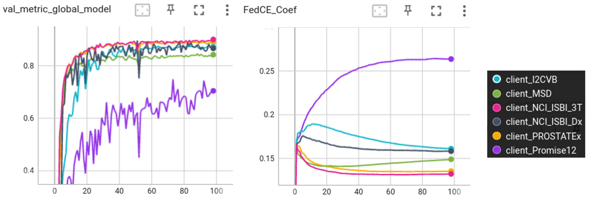

# FedCE: Fair Federated Learning via Client Contribution Estimation

This directory contains the code for the fair federated learning algorithm via client **C**ontribution **E**stimation (Fed**CE**) described in

### Fair Federated Medical Image Segmentation via Client Contribution Estimation ([arXiv:2303.16520](https://arxiv.org/abs/2303.16520))
Accepted to [CVPR2023](https://cvpr2023.thecvf.com/).

###### Abstract:

> How to ensure fairness is an important topic in federated learning (FL). Recent studies have investigated how to reward clients based on their contribution (collaboration fairness), and how to achieve uniformity of performance across clients (performance fairness). Despite achieving progress on either one, we argue that it is critical to consider them together, in order to engage and motivate more diverse clients joining FL to derive a high-quality global model. In this work, we propose a novel method to optimize both types of fairness simultaneously. Specifically, we propose to estimate client contribution in gradient and data space. In gradient space, we monitor the gradient direction differences of each client with respect to others. And in data space, we measure the prediction error on client data using an auxiliary model. Based on this contribution estimation, we propose a FL method, federated training via contribution estimation (FedCE), i.e., using estimation as global model aggregation weights. We have theoretically analyzed our method and empirically evaluated it on two real-world medical datasets. The effectiveness of our approach has been validated with significant performance improvements, better collaboration fairness, better performance fairness, and comprehensive analytical studies

## License
- The code in this directory is released under Apache v2 License.

## Multi-source Prostate Segmentation
This example uses 2D (axial slices) segmentation of the prostate in T2-weighted MRIs based on multiple datasets.

Please refer to [Prostate Example](https://github.com/NVIDIA/NVFlare/tree/main/research/prostate) for details of data preparation and task specs. In the following, we assume the data has been prepared in the same way to `${PWD}/data_preparation`. The dataset is saved to `${PWD}/data_preparation/dataset_2D`, and datalists are saved to `${PWD}/data_preparation/datalist_2D`.

## Setup

> **Development branch note:** `FedCERecipe` requires NVFlare 2.9. Until that package is published, install
> NVFlare from this repository and install the remaining example dependencies separately:
>
> ```bash
> python -m pip install --upgrade pip
> python -m pip install -e "../..[PT]"
> python -m pip install monai tensorboard tqdm nibabel
> ```

The `nvflare[PT]~=2.9.0rc` entry in `requirements.txt` records the first compatible release. After NVFlare 2.9
is published, install the complete environment directly:

```bash
python -m pip install --upgrade pip
python -m pip install -r ./requirements.txt
```

## Run the experiment

The example uses `FedCERecipe` with `SimEnv` to run the six documented clients:
`client_I2CVB`, `client_MSD`, `client_NCI_ISBI_3T`, `client_NCI_ISBI_Dx`, `client_Promise12`, and
`client_PROSTATEx`. The client training script returns model differences and uses `PTFedCEHelper` to construct
and validate the leave-one-out model required by FedCE.

Run six clients on two GPUs, with the workspace under `/tmp`:

```bash
python jobs/fedce_prostate/job.py \
  --data-root "${PWD}/data_preparation" \
  --workspace-root /tmp/nvflare/fedce_prostate \
  --gpu-config 0,1,0,1,0,1 \
  --num-threads 6 \
  --num-rounds 100
```

The minimum GPU memory requirement is 10 GB per GPU. Use `--cache-rate 0` to reduce host memory use at the cost
of loading samples during training.

## Results on six clients for FedCE

### Metrics and FedCE contribution estimation curves

In this example, each client computes their validation scores using their own
validation set. The recipe enables TensorBoard experiment tracking, and each client records
`val_metric_global_model`, `val_metric_minus_model`, `train_loss`, and `FedCE_Coef`.

Launch TensorBoard against the simulation workspace:

```bash
tensorboard --logdir /tmp/nvflare/fedce_prostate
```

The original published implementation's TensorBoard curves of validation Dice and contribution scores for 100 epochs
(100 rounds, 1 local epoch per round) are shown below:



As shown, one of the clients (Promise12) has significant domain shift from others, and hence intuitively it provides more novel information as compared with others. During training, its FedCE weight increases while others gradually decrease. Such that the overall federated learning captures the potential domain variations better. With this mechanism, FedCE provides an indication of reward/profit distribution by measuring the contribution of clients. Please refer to the [FedCE paper](https://arxiv.org/abs/2303.16520) for more details.

The recipe migration was also validated for the full 100 rounds against the original implementation. Promise12's
recipe coefficient increased from `0.1695` at round 1 to `0.2733` at round 99, while the original implementation
increased from `0.1690` to `0.2668`. Across all clients and rounds 1–99, the original and recipe coefficient
series had a correlation of `0.9976`, and the recipe coefficients remained normalized each round. Round 0 has no
prior contribution coefficient and is therefore excluded from this comparison.

## Citation

> Jiang, Meirui, et al. "Fair Federated Medical Image Segmentation via Client Contribution Estimation." Proceedings of the IEEE/CVF Conference on Computer Vision and Pattern Recognition. 2023.

BibTeX
```
@inproceedings{jiang2023fedce,
  title={Fair Federated Medical Image Segmentation via Client Contribution Estimation},
  author={Jiang, Meirui and Roth, Holger R and Li, Wenqi and Yang, Dong and Zhao, Can and Nath, Vishwesh and Xu, Daguang and Dou, Qi and Xu, Ziyue},
  booktitle={Proceedings of the IEEE/CVF Conference on Computer Vision and Pattern Recognition},
  pages={--},
  year={2023}
}
```
