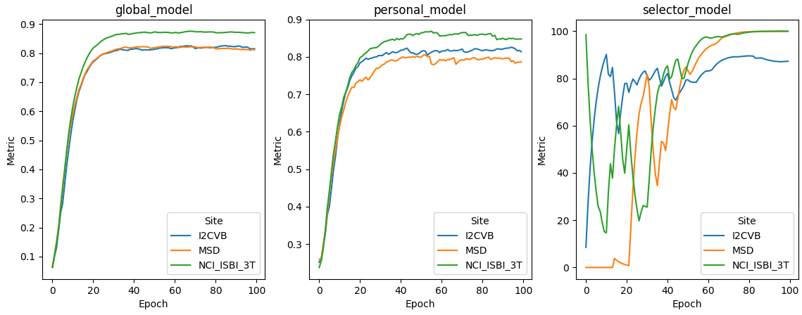

# Personalized Federated Learning with FedSM Algorithm

This directory contains the code for the personalized federated learning algorithm FedSM described in

### Closing the Generalization Gap of Cross-silo Federated Medical Image Segmentation ([arXiv:2203.10144](https://arxiv.org/abs/2203.10144))
Accepted to [CVPR2022](https://cvpr2022.thecvf.com/).

###### Abstract:

> Cross-silo federated learning (FL) has attracted much attention in medical imaging analysis with deep learning in recent years as it can resolve the critical issues of insufficient data, data privacy, and training efficiency. However, there can be a generalization gap between the model trained from FL and the one from centralized training. This important issue comes from the non-iid data distribution of the local data in the participating clients and is well-known as client drift. In this work, we propose a novel training framework FedSM to avoid the client drift issue and successfully close the generalization gap compared with the centralized training for medical image segmentation tasks for the first time. We also propose a novel personalized FL objective formulation and a new method SoftPull to solve it in our proposed framework FedSM. We conduct rigorous theoretical analysis to guarantee its convergence for optimizing the non-convex smooth objective function. Real-world medical image segmentation experiments using deep FL validate the motivations and effectiveness of our proposed method.

## License
- The code in this directory is released under Apache v2 License.

## Multi-source Prostate Segmentation
This example uses 2D (axial slices) segmentation of the prostate in T2-weighted MRIs based on multiple datasets.

Please refer to [Prostate Example](https://github.com/NVIDIA/NVFlare/tree/main/examples/advanced/prostate) for details of data preparation and task specs. In the following, we assume the data has been prepared in the same way to `${PWD}/data_preparation`. The dataset is saved to `${PWD}/data_preparation/dataset_2D`, and datalists are saved to `${PWD}/data_preparation/datalist_2D`.

## Setup

Install required packages for training
```
pip install --upgrade pip
pip install -r ./requirements.txt
```

## Run automated experiments
We use the NVFlare simulator to run FL training automatically, the 3 clients are named `client_I2CVB, client_MSD, client_NCI_ISBI_3T`.
Please note that the training of the selector model shown in this example is to predict the specific client from an input image. Hence, it is an extreme case of label imbalance: each local training only have access to one of the labels. In order to train the model successfully, the moments of Adam optimizer need to be averaged and synced together with model updates. This label imbalance across clients also lead to significant fluctuation of the validation curve (as shown below) before converging to high accuracy for all clients.   

### Prepare local configs
First, we add the image directory root to `config_train.json` files for generating the absolute path to dataset and datalist. 
In the current folder structure, it will be `${PWD}/..`. 
It can be any arbitrary path where the data locates.  
```
for job in fedsm_prostate
do
  sed -i "s|DATASET_ROOT|${PWD}/data_preparation|g" jobs/${job}/app/config/config_train.json
done
```
### Use NVFlare simulator to run the experiments
We use NVFlare simulator to run the FL training experiments, following the pattern:
```
nvflare simulator jobs/[job] -w ${workspace_path}/[job] -c [clients] -gpu [gpu] -t [thread]
```
`[job]` is the experiment job that will be submitted for the FL training. 
In this example, this is `fedsm_prostate`.  
The combination of `-c` and `-gpu`/`-t` controls the resource allocation. 

## Results on three clients for FedSM
In this example, we run three clients on 1 GPU with three threads `-t 3`. The minimum GPU memory requirement is 12 GB. We put the workspace in `/tmp` folder
```
nvflare simulator jobs/fedsm_prostate -w /tmp/nvflare/fedsm_prostate -c client_I2CVB,client_MSD,client_NCI_ISBI_3T -t 3
```

### Validation curve on each site
In this example, each client computes their validation scores using their own
validation set. 

We provide a script for plotting the TensorBoard records:
```
python3 ./result_stat/plot_tensorboard_events.py
```
The TensorBoard curves (smoothed with weight 0.8) for validation Dice for the 100 epochs (100 rounds, 1 local epoch per round) during training are shown below:


### Testing score
The testing score is computed based on the Super Model for FedSM.
We provide a script for performing validation on testing data split. 
Please add the correct paths below, and run:

```
python3 ./result_stat/prostate_2d_test_only.py --models_dir "${workspace_path}/fedsm_prostate/simulate_job/app_server/" --dataset_base_dir ${dataset_path} --datalist_json_path "${datalist_json_path}"
```
The test Dice with FedSM model is 0.7274, while using the global model only (setting --select_threshold 1), the test Dice is 0.7178. FedSM personalized models can achieve better accuracy than the global model, and the selector model can distinguish data from different sites.
## Citation

> Xu, An, et al. "Closing the generalization gap of cross-silo federated medical image segmentation." Proceedings of the IEEE/CVF Conference on Computer Vision and Pattern Recognition. 2022.

BibTeX
```
@inproceedings{xu2022closing,
  title={Closing the generalization gap of cross-silo federated medical image segmentation},
  author={Xu, An and Li, Wenqi and Guo, Pengfei and Yang, Dong and Roth, Holger R and Hatamizadeh, Ali and Zhao, Can and Xu, Daguang and Huang, Heng and Xu, Ziyue},
  booktitle={Proceedings of the IEEE/CVF Conference on Computer Vision and Pattern Recognition},
  pages={20866--20875},
  year={2022}
}
```
