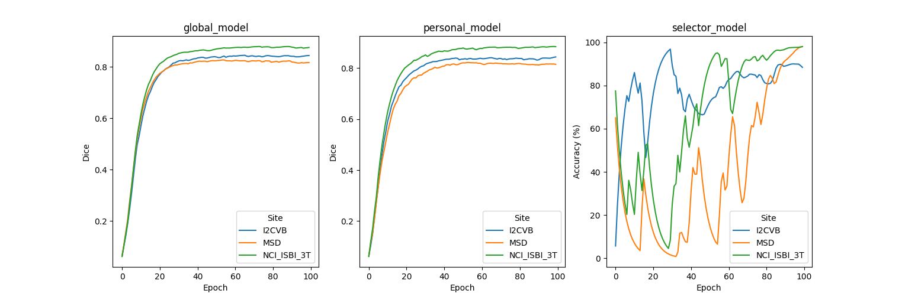

# Personalized Federated Learning with FedSM Algorithm

## Introduction to MONAI, and FedSM

### MONAI
This example shows how to use [NVIDIA FLARE](https://nvidia.github.io/NVFlare) on medical image applications.
It uses [MONAI](https://github.com/Project-MONAI/MONAI),
which is a PyTorch-based, open-source framework for deep learning in healthcare imaging, part of the PyTorch Ecosystem.

### FedSM
This example illustrates the personalized federated learning algorithm [FedSM](https://arxiv.org/abs/2203.10144) accpeted to [CVPR2022](https://cvpr2022.thecvf.com/). It bridges the different data distributions across clients via a SoftPull mechanism and a Super Model setting. 

## (Optional) 1. Set up a virtual environment
```
python3 -m pip install --user --upgrade pip
python3 -m pip install --user virtualenv
```
(If needed) make all shell scripts executable using
```
find . -name ".sh" -exec chmod +x {} \;
```
initialize virtual environment.
```
source ./virtualenv/set_env.sh
```
install required packages for training
```
pip3 install --upgrade pip
pip3 install -r ./virtualenv/min-requirements.txt
```
(optional) if you would like to plot the TensorBoard event files as shown below, please also install
```
pip install -r ./virtualenv/plot-requirements.txt
```
## 2. Multi-source Prostate Segmentation
This example uses 2D (axial slices) segmentation of the prostate in T2-weighted MRIs based on multiple datasets.

Please refer to [Prostate Example](../prostate) for details of data preparation and task specs. In the following, we assume the data has been prepared in the same way to `./data_preparation`.

## 3. Create your FL workspace 

### 3.1 POC ("proof of concept") workspace
In this example, we run FL experiments in POC mode, starting with creating local FL workspace with

```
python3 -m nvflare.lighter.poc
```

Press y and enter when prompted.   
In the following experiments, we will be using 6 clients. Let's rename and make additional client folders as

```
mv poc workspace_prostate
mv workspace_prostate/site-1 workspace_prostate/client_I2CVB
for dataset in MSD NCI_ISBI_3T NCI_ISBI_Dx Promise12 PROSTATEx; do
  cp -r workspace_prostate/client_I2CVB workspace_prostate/client_${dataset}
done
```

### 3.2 (Optional) Secure FL workspace
We only cover POC mode in this example. To run it with Secure mode, please refer to the [`cifar10`](../cifar10) example.
> **_NOTE:_** **POC** stands for "proof of concept" and is used for quick experimentation 
> with different amounts of clients.
> It doesn't need any advanced configurations while provisioning the startup kits for the server and clients. 
>
> The **secure** workspace, on the other hand, is needed to run experiments that require encryption keys. These startup kits allow secure deployment of FL in real-world scenarios 
> using SSL certificated communication channels.

### GPU resource and Multi-tasking
In this example, we assume two local GPUs with at least 12GB of memory are available. 

As we use the POC workspace without `meta.json`, we control the client GPU directly when starting the clients by specifying `CUDA_VISIBLE_DEVICES`. 

To enable multi-tasking, here we adjust the default value in `workspace_server/server/startup/fed_server.json` by setting `max_jobs: 2` (defualt value 1). Please adjust this properly accodrding to resource available and task demand. 

(Optional) If using secure workspace, in secure project configuration `secure_project.yml`, we can set the available GPU indices as `gpu: [0, 1]` using the `ListResourceManager` and `max_jobs: 2` in `DefaultJobScheduler`.

For details, please refer to the [documentation](https://nvflare.readthedocs.io/en/dev-2.1/user_guide/job.html).

## 4. Run automated experiments
The next scripts will start the FL server and clients automatically to run FL experiments on localhost.
### 4.1 Prepare local configs
First, we add the image directory root to `config_train.json` files for generating the absolute path to dataset and datalist. In the current folder structure, it will be `${PWD}/..`, it can be any arbitary path where the data locates.  
```
for alg in fedsm_prostate
do
  sed -i "s|DATASET_ROOT|${PWD}/data_preparation|g" configs/${alg}/config/config_train.json
done
```
### 4.2 Start the FL system and submit jobs
Next, we will start the FL system and submit jobs to start FL training automatically.

Start the FL system with 6 clients for federated learning by running
```
bash start_fl_poc.sh "I2CVB MSD NCI_ISBI_3T NCI_ISBI_Dx Promise12 PROSTATEx"
```
This script will start the FL server and clients automatically to run FL experiments on localhost. 
Each client will be alternately assigned a GPU using `export CUDA_VISIBLE_DEVICES=${gpu_idx}` in the [start_fl_poc.sh](./start_fl_poc.sh). 
In this example, we run six clients on two GPUs, three clients for each GPU with 12 GB memory.  

Then FL training will be run with an automatic script utilizing the FLAdminAPI functionality by running
```
bash ./submit_job.sh fedsm_prostate
```

Note that since the current experiments are performed on a light 2D dataset, we used [`CacheDataset`](https://docs.monai.io/en/stable/data.html#cachedataset) and set cache rate to 1.0 to accelerate the training process. Please adjust the cache rate if memory resource is limited on your system.

## 5. Results on 6 clients for FedSM and compare with other algorithms
We compute the result of FedSM and compare it with other algorithms from [Prostate 2D Example](../prostate/prostate_2D), including Central/FedAvg/FedProx/Ditto.
For FedSM, the Super Model will be used for evaluation. For Central/FedAvg/FedProx, only the global model gets evaluated at each round, and saved as the final model. For Ditto, each client will have its own personalized model, which is validated and saved locally.
### Validation curve on each site

Let's summarize the result of the experiments run above. We compare the validation scores of 
the global model for Central/FedAvg/FedProx, and personalized models for FedSM/Ditto. In this example, each client computes their validation scores using their own
validation set, and the centralized model computes the validation score using the combined validation set. 

We provide a script for plotting the tensorboard records, running
```
python3 ./result_stat/plot_tensorboard_events.py
```
The TensorBoard curves (smoothed with weight 0.8) for validation Dice for the 150 epochs (150 rounds, 1 local epochs per round) during training are shown below:


### Testing score
The testing score is computed based on the super model for FedSM, the best global model for Central/FedAvg/FedProx, and the six best personalized models for Ditto.
We provide a script for performing validation on testing data split, please add the correct paths and job_ids, and run

```
bash ./result_stat/testing_models_2d.sh
```
Note that for FedSM/Ditto, the score is the average Dice among all 6 personalized models evaluated on their own testing data weighted by testing data size.

The Dice results for the above run are:

| Config	          | 	Val Dice	 | 
|------------------|------------|
| fedsm_prostate | |
| prostate_central | 	0.8590	 | 
| prostate_fedavg  |   0.8324   | 
| prostate_fedprox |   0.8131   | 
| prostate_ditto   | 	0.8474	 |