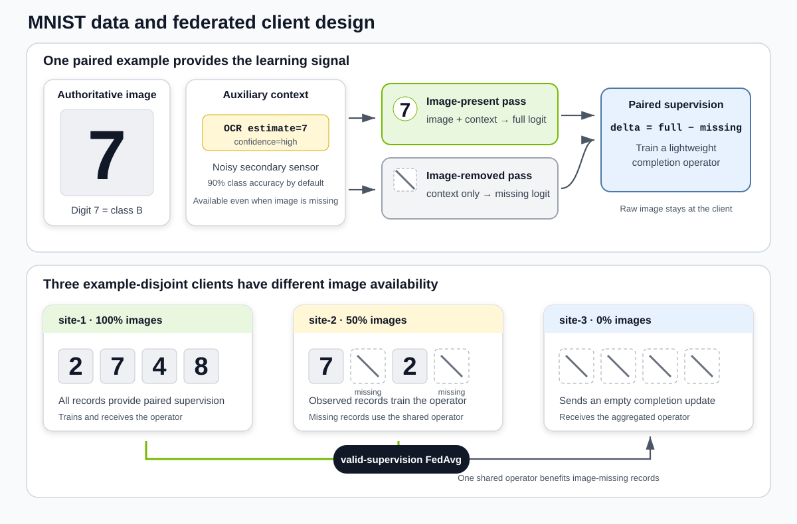
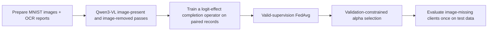

# FedCoRe: Federated Cross-Modal Representation Completion

This is the public NVIDIA FLARE starter implementation of the FedCoRe paper,
[FedCoRe: Target-Adaptive Completion for Missing Modalities in Healthcare Federated Learning](https://arxiv.org/abs/2608.18311)
(arXiv:2608.18311, 2026).


**This starter learns a missing-modality completion operator from clients with paired data and shares it with clients
that never observe that modality.**

In many federated deployments, some sites record every input (for example, an image plus a text report), while others
have only the text. A model trained to use both then underperforms exactly where the image is missing. FedCoRe lets the
sites that *do* have paired data learn a small correction operator in classifier-logit space that estimates what the
missing image would have contributed. The operator is federated with FedAvg and applied at inference by sites without
images.

The example demonstrates these mechanics end to end with NVIDIA FLARE, a frozen Qwen3-VL predictor, and MNIST digits
paired with simulated noisy OCR text reports. It is deliberately a toy so that the data, missing-image pattern, and
expected outcome are easy to inspect. It is not clinical evidence and makes no formal privacy guarantee; see
[Scope and limitations](#scope-and-limitations).

## At a glance

| | |
| --- | --- |
| What you will see | Three simulated clients with 100%, 50%, and 0% image availability. Validation picks a completion strength `alpha`; missing-image AUROC improves in the `recoverable` scenario and stays at the identity (`alpha=0`) in the `uninformative` control. |
| What you need | A clone of this repository (the example reuses helper code from `examples/advanced/qwen3-vl`), Python 3.10 or newer, one CUDA GPU for the quickstart, and internet access on the first run (Qwen3-VL-2B weights from Hugging Face, MNIST via torchvision). |
| How long | About 20 minutes on a modern data-center GPU (validated on an NVIDIA H100); model download and hardware speed dominate. |
| What you get | `evaluation/summary.json` with before/after metrics and the selected `alpha`, per-site metrics, per-round client logs, and the federated completion checkpoint. |

## Quickstart

### 1. Install

Quick mode uses PyTorch SDPA attention and does not need FlashAttention.

```bash
cd research/fedcore
python3 -m venv .venv
source .venv/bin/activate
python -m pip install --upgrade pip
python -m pip install -r requirements.txt
```

The default model is [`Qwen/Qwen3-VL-2B-Instruct`](https://huggingface.co/Qwen/Qwen3-VL-2B-Instruct); review its license before use. MNIST is downloaded through `torchvision` into `~/.cache/nvflare/fedcore` (override with `--dataset-root`).

### 2. Run the recoverable scenario

```bash
python run_demo.py --mode quick --scenario recoverable --gpu 0
```

This prepares the data, extracts Qwen3-VL features for all three sites on one GPU, runs the federated completion job on CPU, selects `alpha` on validation data, and evaluates once on test data. Results land in `outputs/recoverable_seed7/`.

### 3. Run the negative control

```bash
python run_demo.py --mode quick --scenario uninformative --gpu 0
```

Here the OCR text carries no class information, so there is nothing to recover; validation should keep the identity operator (`alpha=0`).

> **Each run needs fresh directories.** `run_demo.py` refuses to reuse an existing output directory or NVFlare
> workspace so that runs can never mix artifacts. To repeat a scenario, pass a new `--output-dir` (and a new
> `--workspace` if you set one explicitly), or remove the previous run directories.

### 4. Read the results

The console prints a before/after table and the selected `alpha`; the same numbers are in `outputs/<scenario>_seed<seed>/evaluation/summary.json`.

| Term | Meaning |
| --- | --- |
| Missing-image AUROC | Test AUROC on records whose image is genuinely unavailable: the text-only prediction before completion, the completed prediction after. |
| Aggregate AUROC | Test AUROC on all records of all clients under the deployed policy: image-present records use the image, image-missing records use completion. |
| Paired image-present AUROC | Test AUROC of the frozen predictor when the image is available; an upper reference. |
| `alpha` | Completion strength selected on validation data; `0` is an exact identity (no change). |

Expected behavior:

- `recoverable`: a nonzero `alpha`, higher missing-image AUROC at every missing-image client, and no drop in aggregate validation performance.
- `uninformative`: `alpha=0` and identical before/after numbers.
- `site-3` reports `sent_empty_update=true` every round: it has no paired supervision and contributes no update.

Reference numbers from one deterministic seed-7 run with `Qwen/Qwen3-VL-2B-Instruct` on an NVIDIA H100. These are tutorial checks, not benchmark or clinical claims, and exact values depend on the model version and runtime:

| Scenario | Paired image-present AUROC | Missing before | Missing after | Missing delta | Aggregate delta | Selected `alpha` |
| --- | ---: | ---: | ---: | ---: | ---: | ---: |
| `recoverable` | 0.9885 | 0.9386 | 0.9911 | +0.0525 | +0.1174 | 1.0 |
| `uninformative` | 0.9889 | 0.5033 | 0.5033 | +0.0000 | +0.0000 | 0.0 |

## How it works

### The toy task

Each record is an MNIST digit image plus a one-line text report from a simulated noisy OCR sensor: an estimated digit and a `high` or `low` confidence. Digits 0 to 4 are class `A`; digits 5 to 9 are class `B`. The image is authoritative; the text is imperfectly correlated with it.

- **`recoverable`** (default): the OCR *class* is correct with probability `--proxy-strength` (0.9). Correct estimates are usually reported with high confidence and wrong ones with low confidence, so the text contains a recoverable signal about its own reliability that the frozen predictor does not fully exploit on its own.
- **`uninformative`** (negative control): OCR class and confidence are exactly balanced within every client and split, independent of the true class. There is nothing transferable to learn.

Three example-disjoint clients share the same image-availability pattern across the train, validation, and test splits:

| Client | Image availability (all splits) | Role |
| --- | ---: | --- |
| `site-1` | 100% | Paired image-present/image-removed supervision |
| `site-2` | 50% | Mixed: supervision from its paired records, deployment on its image-missing records |
| `site-3` | 0% | Deployment only; never sends a completion update |



MNIST source indices are allocated without replacement across all sites and splits. Train and validation records come from disjoint parts of the official training set; test records come from the official test set. Data generation is deterministic given `--seed`.

### The pipeline



For every record the frozen predictor is run once *without* the image, producing a text-only classifier logit (`missing_logit`) and the final hidden state (`missing_hidden`). For records that have an image it is also run *with* the image (`full_logit`). The exchanged model is a small MLP that predicts an additive residual from the hidden state:

```text
completed_logit = missing_logit + alpha * completion(missing_hidden)
```

Only paired records can supervise the image's contribution `full_logit - missing_logit`, so only clients that hold paired records train the operator. A client with no paired records sends **empty model parameters**, which makes the FedAvg aggregator skip its update entirely; it also reports `NUM_STEPS_CURRENT_ROUND=0` to make the lack of valid supervision explicit in logs and metrics.

### Choosing the completion strength

Each client summarizes its own validation data (loss sums, counts, and AUROC per candidate `alpha`); no example-level predictions leave the client. The evaluator then picks the `alpha` with the lowest pooled missing-image log loss, subject to two safeguards relative to the identity policy `alpha=0`:

1. the aggregate log loss over all validation records must not get worse (`--aggregate-loss-tolerance`, default 0), and
2. no missing-image client's validation AUROC may regress (`--client-auroc-tolerance`, default 0).

Because `alpha=0` always satisfies both, the identity operator is the guaranteed fallback. Test caches are opened only after the selection is final.

## Configuration

Most options are set on `run_demo.py` and forwarded to the stage scripts.

| Option | Default | Meaning |
| --- | --- | --- |
| `--mode` | `quick` | `quick` uses the frozen public Qwen3-VL predictor; `full` first federates a Qwen LoRA adapter (see below). |
| `--scenario` | `recoverable` | `recoverable` or `uninformative`. |
| `--proxy-strength` | `0.9` | OCR class accuracy in the `recoverable` scenario. Not accepted for `uninformative`, which is fixed at 0.5 to keep the control exactly balanced. |
| `--seed` | `7` | Non-negative seed controlling data allocation, OCR noise, model initialization, and training order. |
| `--train-samples-per-site`, `--val-samples-per-site`, `--test-samples-per-site` | `96`, `64`, `64` | Records per site and split. Each must be at least 8 and divisible by 4 (by 8 for `uninformative`). At intermediate proxy strengths, each recoverable split must be large enough to include correct and incorrect OCR estimates in both classes. |
| `--num-rounds`, `--local-epochs` | `10`, `10` | Federated rounds and local epochs per round for the completion operator. |
| `--learning-rate`, `--hidden-dim`, `--task-weight`, `--effect-weight` | `1e-3`, `128`, `4.0`, `0.25` | Completion-operator optimizer settings and loss weights. |
| `--alpha-grid` | `0,0.25,0.5,0.75,1,1.5,2` | Candidate completion strengths; must include `0`. |
| `--feature-batch-size` | `2` | Qwen3-VL batch size during feature extraction; raise it on GPUs with more memory. |
| `--gpu` | none | Quick mode: the GPU index for feature extraction (defaults to 0). Full mode: one bracket group per client, for example `"[0],[1],[2]"`. |
| `--output-dir`, `--workspace`, `--dataset-root` | `outputs/<scenario>_seed<seed>`, `<output-dir>/workspace`, `~/.cache/nvflare/fedcore` | Where results, the NVFlare simulator workspace, and the reusable MNIST download live. |

Each stage can also be run on its own (`prepare_data.py`, `cache_features.py`, `job.py`, `evaluate.py`); run `python <script>.py --help` for the per-stage flags. For example, to prepare data separately:

```bash
python prepare_data.py --output-dir data/recoverable --scenario recoverable --proxy-strength 0.9 --seed 7
```

## Optional: federated Qwen LoRA predictor (full mode)

Full mode first runs the existing [`examples/advanced/qwen3-vl`](../../examples/advanced/qwen3-vl/README.md) job to federate a Qwen3-VL LoRA adapter across the three clients (image-missing clients train on their OCR text only), freezes the resulting global predictor, and then runs the same completion workflow on top of it.

It needs one GPU per client, FlashAttention, and the upstream example's dependency set. Install with the upstream installer, which installs PyTorch before building `flash_attn` with `--no-build-isolation` (a compatible CUDA toolkit and compiler must be available):

```bash
bash ../../examples/advanced/qwen3-vl/install_requirements.sh "$(pwd)/requirements-full.txt"
python run_demo.py --mode full --scenario recoverable --gpu "[0],[1],[2]"
```

`--predictor-rounds` (default 1) and `--predictor-max-steps` (default 10) control the LoRA budget. `--lora-r` and `--lora-alpha` (defaults 64 and 128) must match between adapter training and feature extraction; `run_demo.py` passes them to both stages. Full-mode checkpoints are large, so use `--workspace` to point at a filesystem with enough space.

## Outputs

By default everything is written under `outputs/<scenario>_seed<seed>/`:

```text
run_config.json                    resolved command configuration
data/
  dataset_summary.json             per-site and per-split counts and realized OCR statistics
  site-*/{train,val,test}.jsonl    local manifests (labels, OCR context, image paths)
  site-*/images/                   rendered MNIST digits (image-available records only)
  site-*/train.json                Qwen SFT records used by full mode
feature_cache/
  metadata.json                    input_dim, per-site paired/missing counts, model info
  site-*/{train,val,test}.pt       Qwen3-VL caches (tensors only; see the cache contract below)
completion/
  site-*/round_*.json              per-round client metrics, including sent_empty_update
  global_model.pt                  final federated completion checkpoint
  job_result.json                  NVFlare job status and result location
evaluation/
  summary.json                     selection table, before/after metrics, selected alpha
  per_site_metrics.json            the same metrics per client
workspace/                         NVFlare simulator workspace (completion/, plus qwen_predictor/ in full mode)
```

`summary.json` also records the validation candidate table and each client's validation sufficient statistics, so you can see why an `alpha` was chosen. Pooled AUROC is computed by this single-machine simulator for tutorial verification only; it is not a privacy-preserving production metric.

## Project structure

| Path | Purpose |
| --- | --- |
| `run_demo.py` | One-command orchestration of all stages (quick and full modes). |
| `prepare_data.py`, `src/data.py` | MNIST download, deterministic disjoint allocation, OCR simulation, SFT export. |
| `cache_features.py`, `src/qwen_backend.py`, `src/features.py` | Qwen3-VL image-present/image-removed passes; cache writing, loading, and validation. |
| `job.py`, `client.py`, `model.py`, `src/federated.py` | NVFlare `FedAvgRecipe` job, the client training loop, the completion MLP, and the empty-update helpers. |
| `evaluate.py`, `src/evaluation.py`, `src/metrics.py` | Validation-constrained `alpha` selection and held-out evaluation with dependency-light metrics. |
| `tests/unit_test/examples/fedcore_*_test.py` | Unit tests (repository root). Run `python -m pytest tests/unit_test/examples/fedcore_*_test.py` from the repository root. |

## Adapting to your own data

The completion job is target-modality neutral: replace data preparation and feature extraction, keep the cache contract, and `job.py` and `evaluate.py` run unchanged. Per site (`site-1`, `site-2`, `site-3`) and split (`train`, `val`, `test`), write `feature_cache/<site>/<split>.pt` containing a dictionary with these fields:

| Field | Type and shape | Rule |
| --- | --- | --- |
| `schema_version` | integer | Must equal the current cache schema version (`1`). |
| `example_ids` | `list[str]`, length N | Unique within the cache. |
| `labels` | integer tensor, `(N,)` | Only 0 and 1. |
| `image_available` | bool tensor, `(N,)` | Whether the modality to complete was observed. |
| `paired_mask` | bool tensor, `(N,)` | Must equal `image_available`. |
| `missing_features` | float tensor, `(N, D)` | Hidden state from the modality-removed pass; finite. |
| `missing_logits` | float tensor, `(N,)` | Modality-removed classifier logit; finite. |
| `full_logits` | float tensor, `(N,)` | Modality-present logit: finite where `paired_mask` is true, `NaN` elsewhere. |

Also write `feature_cache/metadata.json` with `schema_version`, `input_dim` (equal to D), and, for each site,
`sites.<site>.train.paired_examples`; `evaluate.py` reads both. Caches are loaded with PyTorch's restricted
`weights_only=True` deserializer: store numeric arrays as `torch.Tensor` values (convert NumPy arrays first) and use
only built-in Python containers. Violations fail with an explicit schema error before training.

Real deployments should generate caches at each site, replace the pooled tutorial evaluation with an approved federated validation protocol, and derive modality masks from the actual acquisition workflow.

## Scope and limitations

- **Toy data.** MNIST plus a simulated OCR sensor does not model clinical missingness, institutional shift, or the difficulty of recovering a patient-specific modality. Tutorial gains are not evidence for clinical deployment.
- **No formal privacy guarantee.** Raw images and text stay in site-specific directories and clients exchange only completion parameters, but model updates can leak information without additional controls such as secure aggregation or differential privacy.
- **Single-machine evaluation.** The evaluator reads all site caches to report pooled AUROC. That is a tutorial diagnostic, not a federated metric.
- **Small splits.** Split sizes are validated (at least 8, divisible by 4 or 8), and unrealizable OCR configurations
  are rejected before data are written. For accepted runs, `data/dataset_summary.json` records both requested and
  realized OCR rates.

## License and citation

The code in this directory follows NVFlare's Apache License 2.0; see the [repository license](../../LICENSE). MNIST is downloaded separately through [`torchvision.datasets.MNIST`](https://docs.pytorch.org/vision/stable/generated/torchvision.datasets.MNIST.html); review the dataset's source terms before use. Qwen3-VL weights are downloaded separately and have their own terms; see the [model card](https://huggingface.co/Qwen/Qwen3-VL-2B-Instruct). Full mode reuses the upstream example, whose vendored Qwen training code is attributed in its [NOTICE](../../examples/advanced/qwen3-vl/NOTICE).

Holger R. Roth, Ziyue Xu, and Peter Cnudde, "[FedCoRe: Target-Adaptive Completion for Missing Modalities in Healthcare Federated Learning](https://arxiv.org/abs/2608.18311)," arXiv:2608.18311, 2026.
