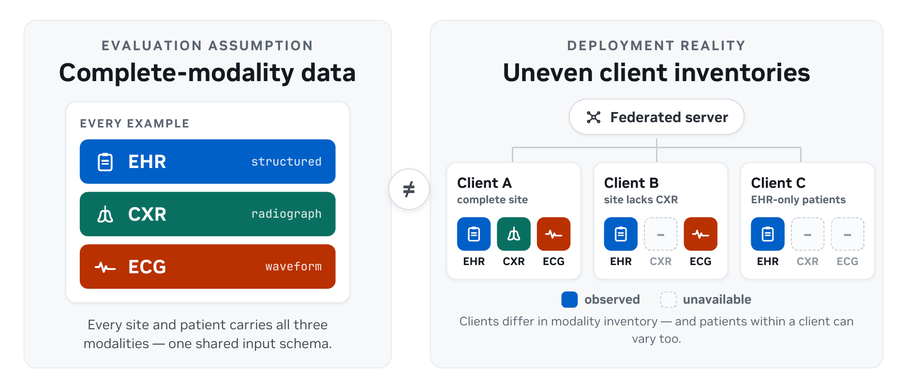
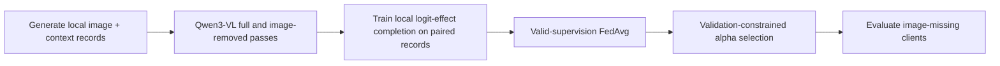

# FedCoRe: Federated Cross-Modal Representation Completion

FedCoRe is a research starter for learning a missing-modality completion operator from clients that have valid paired
supervision, then sharing that operator with clients that do not observe the modality. This project provides a small,
public, end-to-end NVIDIA FLARE workflow using Qwen3-VL and generated image-plus-context data.

The accompanying paper is available on arXiv: [FedCoRe: Target-Adaptive Completion for Missing Modalities in Healthcare Federated Learning](https://arxiv.org/abs/2608.18311).



## Objective

Demonstrate the mechanics of federated cross-modal completion with public model weights and generated data: clients
that observe images learn an additive classifier-logit correction, clients without paired image supervision have zero
aggregation weight, and validation can retain the identity operator when completion is unsupported.

## Background

Multimodal FL clients often differ in which inputs they observe. A client without a modality cannot directly train a
completion operator for that modality, but it can consume an operator learned from other clients with paired
target-present and target-removed passes. FedCoRe formalizes that valid-supervision exchange without reconstructing
raw images.

## Synthetic data and client design

The generated task contains a red triangle (class `A`) or blue circle (class `B`) and an opaque auxiliary scanner
code. The image is authoritative. The code is correlated with the image class, but its arbitrary `KAPPA`/`SIGMA`
mapping is not explained to the frozen predictor. Paired clients can therefore learn the mapping from its hidden
state without exposing the class directly in the text. Modality availability differs across three disjoint simulated
clients:

| Client | Training image availability | Role |
| --- | ---: | --- |
| `site-1` | 100% | Paired image-present/image-removed supervision |
| `site-2` | 50% | Patient-mixed supervision and deployment examples |
| `site-3` | 0% | Missing-image deployment only; sends no completion update |

The default `recoverable` scenario correlates the code strongly with the image class. The `uninformative` control
balances code matches and mismatches within each class, removing that cross-modal relationship and testing whether
validation retains the identity operator. These generated outcomes verify the workflow; they are not clinical
evidence.



For an image-present record, the frozen predictor produces `full_logit`; removing the image produces
`missing_logit` and `missing_hidden`. The exchanged completion model predicts an additive residual:

```text
completed_logit = missing_logit + alpha * completion(missing_hidden)
```

Only paired records can supervise the image contribution `full_logit - missing_logit`. A client with no paired
records sends empty model parameters, which makes the aggregator skip its update; it also reports
`NUM_STEPS_CURRENT_ROUND=0` to make the lack of valid supervision explicit.
Validation selection combines only per-client loss sums and counts. The optional pooled test AUROC is a
single-machine tutorial diagnostic, not a production federated metric.

## Repository layout

| Path | Purpose |
| --- | --- |
| `prepare_data.py` | Generate deterministic, disjoint client data and Qwen SFT JSON. |
| `cache_features.py` | Run Qwen3-VL full/image-removed passes or create test-only mock caches. |
| `model.py` | Define the lightweight classifier-logit completion operator. |
| `client.py` | Train on valid paired records and implement empty-update behavior. |
| `job.py` | Configure the three-client completion job with `FedAvgRecipe`. |
| `evaluate.py` | Select `alpha` on validation summaries, then evaluate once on test data. |
| `run_demo.py` | Orchestrate data, optional Qwen LoRA FL, completion FL, and reporting. |

Data are generated automatically by `run_demo.py`. To prepare them separately:

```bash
python prepare_data.py --output-dir data/recoverable --proxy-strength 0.9 --seed 7
```

## Setup

Quick mode uses PyTorch SDPA and does not require FlashAttention:

```bash
cd research/fedcore
python3 -m venv .venv
source .venv/bin/activate
python -m pip install --upgrade pip
python -m pip install -r requirements.txt
```

The default model is [`Qwen/Qwen3-VL-2B-Instruct`](https://huggingface.co/Qwen/Qwen3-VL-2B-Instruct). Review its
model license before use. The first run downloads model weights from Hugging Face.

## One-GPU quickstart

The quickstart uses the frozen Qwen3-VL predictor, extracts all site features sequentially on one GPU, and runs the
small completion clients on CPU:

```bash
python run_demo.py --mode quick --scenario recoverable --gpu 0
```

It is designed to finish in about 20 minutes on a modern data-center GPU, although model download and hardware speed
affect runtime. Run the low-correlation control with:

```bash
python run_demo.py --mode quick --scenario uninformative --gpu 0
```

For a CPU-only pipeline smoke test without downloading Qwen:

```bash
python run_demo.py \
  --mode quick \
  --scenario recoverable \
  --feature-backend mock \
  --train-samples-per-site 12 \
  --val-samples-per-site 6 \
  --test-samples-per-site 6 \
  --num-rounds 2
```

The mock backend validates orchestration and FL behavior only. It is not a Qwen result.

## Expected behavior

- `recoverable`: validation should select a nonzero `alpha`, and missing-image performance should improve.
- `uninformative`: validation should select `alpha=0` or otherwise satisfy the aggregate no-harm constraint.
- `site-3`: every round should report `sent_empty_update=true` because the client has no paired image supervision.

Exact Qwen metrics depend on the model and runtime.

The default seed-7 commands were validated with `Qwen/Qwen3-VL-2B-Instruct` on one NVIDIA H100 NVL against an
editable NVFlare source checkout rebased on upstream `main`. These are tutorial checks, not benchmark claims:

| Scenario | Missing AUROC before | Missing AUROC after | Aggregate AUROC before | Aggregate AUROC after | Selected `alpha` |
| --- | ---: | ---: | ---: | ---: | ---: |
| `recoverable` | 0.1806 | 0.8681 | 0.7951 | 0.9670 | 0.75 |
| `uninformative` | 0.5625 | 0.5972 | 0.8906 | 0.8993 | 0.75 |

The low-correlation control's small rank change is not evidence of cross-modal recovery. Its nonzero scale primarily
reduces the frozen model's biased answer-token loss while satisfying the aggregate no-harm constraint. Depending on
the model version and validation sample, this control may instead retain `alpha=0`.

## Optional federated Qwen LoRA mode

Full mode first invokes the existing [`examples/advanced/qwen3-vl`](../../examples/advanced/qwen3-vl/README.md)
training stack. It federates Qwen LoRA adapters, freezes the resulting global predictor, and then runs the same
completion workflow. Install the full dependency set and use one GPU per client:

```bash
bash ../../examples/advanced/qwen3-vl/install_requirements.sh "$(pwd)/requirements-full.txt"
python run_demo.py --mode full --scenario recoverable --gpu "[0],[1],[2]"
```

Use `--predictor-rounds` and `--predictor-max-steps` to change the optional predictor budget. Full mode reuses the
upstream Qwen3-VL implementation and attribution rather than maintaining a second copy here.
The installer deliberately installs PyTorch before building `flash_attn` with `--no-build-isolation`; a compatible
CUDA toolkit and compiler must be available. The synthetic proxy code is withheld from LoRA supervision so the
predictor cannot learn the completion shortcut directly.

The full path was smoke-tested with three clients, one LoRA FedAvg round, and one local training step. The resulting
global adapter was reloaded for Qwen cache generation before the valid-supervision completion job ran end to end.

## Outputs

By default, runs write to `outputs/<scenario>_seed<seed>/`:

```text
data/                         generated local records and images
feature_cache/site-*/         local Qwen or mock caches
completion/site-*/            per-round valid-supervision metrics
completion/global_model.pt     final federated completion checkpoint
evaluation/summary.json       aggregate selection and evaluation report
evaluation/per_site_metrics.json
run_config.json               resolved command configuration
```

`run_demo.py` places the NVFlare workspace under the run's output directory by default, so full-mode checkpoints use
persistent project storage rather than `/tmp`. Direct `job.py` use retains its own `/tmp/nvflare/fedcore` default.
Use `--workspace` to select a larger filesystem. Both output and workspace paths must be fresh; existing paths are
rejected to prevent concurrent runs or stale checkpoints from being mixed.

`summary.json` reports image-present performance on paired examples, naturally image-missing performance before and
after completion, aggregate policy performance, contributing clients and paired-example counts, the selected `alpha`,
per-client validation sufficient statistics, and the full validation candidate table. Test caches are opened only
after validation selection completes.

Pooled AUROC is computed locally by this single-machine simulator for tutorial verification. It is not a
privacy-preserving production aggregation protocol.

## Adapting to another modality or dataset

The cache contract is target-modality neutral. Replace the generator and feature extractor while preserving these
fields per site and split:

- `example_ids`, `labels`, and `image_available` (rename semantically in your loader if needed);
- `missing_features` and `missing_logits` for every record;
- `paired_mask`, equal to the boolean availability mask, and `full_logits`, finite for paired examples and `NaN`
  elsewhere.

Cache files are loaded with PyTorch's restricted `weights_only=True` deserializer. Store numeric arrays as
`torch.Tensor` values and use only built-in Python containers for metadata; convert NumPy arrays before `torch.save`.
Labels must be binary integer tensors, masks must be boolean, and feature/logit tensors must follow the finite/`NaN`
contract above. Unsupported or corrupt serialized objects fail before training.

The completion job then remains unchanged. Real deployments should generate caches at each site, use an appropriate
federated validation metric, and define modality masks from their actual acquisition workflow.

## Privacy and limitations

Raw images and text records remain in site-specific directories during training, and clients exchange only completion
parameters. The single-machine tutorial evaluator can read all site caches to report pooled AUROC; a production
deployment should replace that diagnostic with an approved federated evaluation protocol. This workflow does not
provide a formal privacy guarantee: model updates can leak information without additional controls such as secure
aggregation or differential privacy.

The synthetic proxy is intentionally controllable and does not model clinical missingness, institutional shift, or
the difficulty of recovering a patient-specific radiograph contribution. Do not interpret tutorial gains as evidence
for clinical deployment.

## License

The code in this directory follows NVFlare's Apache License 2.0; see the [repository license](../../LICENSE).
Qwen3-VL model weights are downloaded separately and have their own terms; review the
[model card](https://huggingface.co/Qwen/Qwen3-VL-2B-Instruct). Optional full mode reuses the upstream example, whose
vendored Qwen training code is attributed in its [NOTICE](../../examples/advanced/qwen3-vl/NOTICE).

## Citation

Holger R. Roth, Ziyue Xu, and Peter Cnudde, "[FedCoRe: Target-Adaptive Completion for Missing Modalities in Healthcare Federated Learning](https://arxiv.org/abs/2608.18311)," arXiv:2608.18311, 2026.
