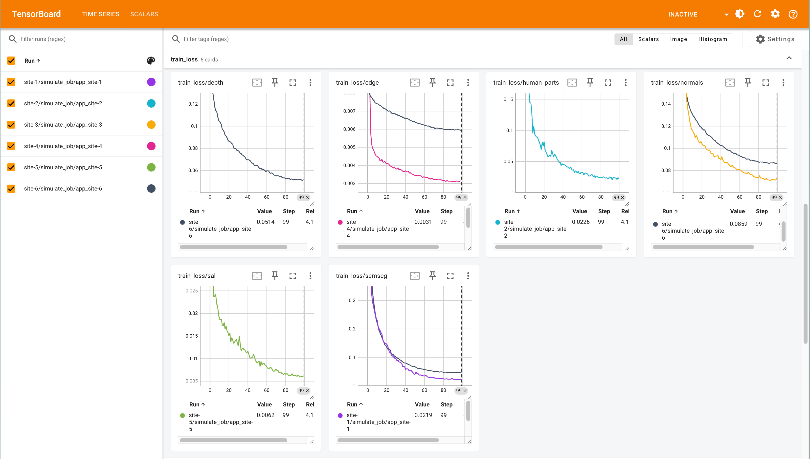
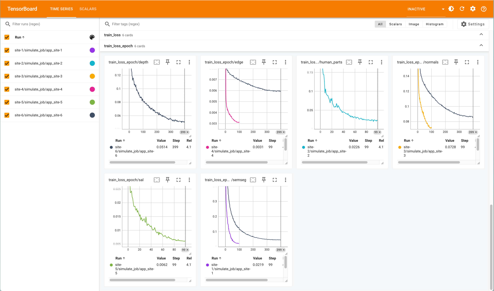
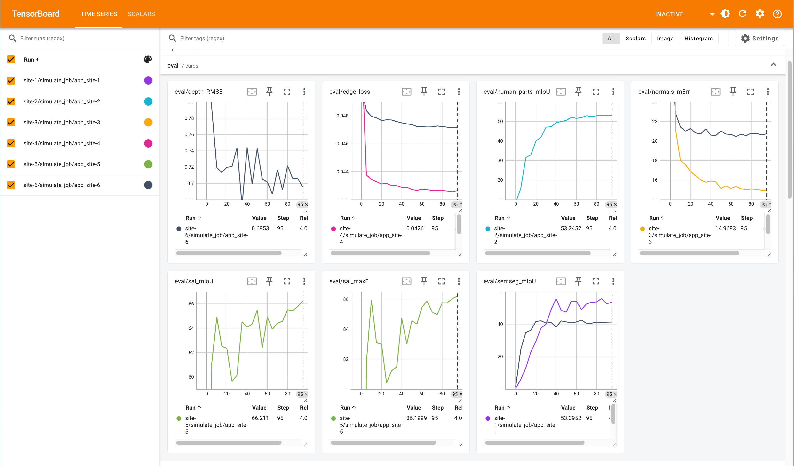

<p align="center">
  <h1 align="center">FedHCA<sup>2</sup>: Towards Hetero-Client Federated Multi-Task Learning (NVFLARE Implementation)</h1>
  <p align="center">
    <strong><a href="https://innovator-zero.github.io/">Yuxiang Lu</a><sup>*</sup></strong>
    &nbsp;&nbsp;
    <strong><a href="https://jeandiable.github.io/">Suizhi Huang</a><sup>*</sup></strong>
    &nbsp;&nbsp;
    <strong>Yuwen Yang</strong>
    &nbsp;&nbsp;
    <strong>Shalayiding Sirejiding</strong>
    &nbsp;&nbsp;
    <strong>Yue Ding</strong>
    &nbsp;&nbsp;
    <strong>Hongtao Lu</strong>
  </p>

  <p align="center">
  <a href="https://openaccess.thecvf.com/content/CVPR2024/html/Lu_FedHCA2_Towards_Hetero-Client_Federated_Multi-Task_Learning_CVPR_2024_paper.html"></a>
  <a href="https://arxiv.org/abs/2311.13250"></a>
  </p>
</p>

This directory contains an NVFLARE implementation of the FedHCA² algorithm for federated multi-task learning with heterogeneous clients.

## Overview

FedHCA² addresses the challenge of federated learning across heterogeneous clients with different task configurations. This implementation uses NVIDIA FLARE to support:

- **Conflict-Averse Encoder Aggregation**: Mitigates parameter conflicts between clients
- **Cross-Attention Decoder Aggregation**: Enables personalized model adaptation
- **Learnable Hyperweights**: Dynamic client contribution weighting
- **Heterogeneous Client Support**: Mixed single-task and multi-task clients
- **Flexible Configuration**: Easy modification of client setups and hyperparameters
- 
## License
This project is open-sourced under the Apache v2 License. The codebase builds upon the initial work shared at [FedHCA2](https://github.com/innovator-zero/FedHCA2).

## Requirements

### Environment Setup

Create a conda environment with the required dependencies:

```bash
# Create environment
conda create -n fedhca2 python=3.10
conda activate fedhca2

# Install PyTorch and related packages
pip install -r requirements.txt
```

### Dataset Setup

Download the required datasets:

1. **PASCAL-Context**: [Download Link](https://drive.google.com/file/d/1TWZydr5_r4hKDM5Zyzrcq712Stg2cw7p/view?usp=drive_link)
2. **NYUD-v2**: [Download Link](https://drive.google.com/file/d/1rj3tHdQVYqe-Y3mpxv4EgWsiqgq3z87H/view?usp=drive_link)

Extract both datasets to the `data/` directory:

```bash
# Example directory structure after extraction
research/fedhca2/data/
├── PASCALContext/
│   ├── JPEGImages/
│   ├── pascal-context/
│   ├── json/
│   └── ...
└── NYUDv2/
    ├── images/
    ├── segmentation/
    ├── depth/
    └── ...
```

Update the dataset path in `jobs/fedhca2/app/custom/fedhca2_core/datasets/utils/mypath.py` and `jobs/fedhca2/app/custom/data_utils/data_loader.py` to point to your data directory.

## Usage

### Quick Start

Run the default experiment with 6 clients (5 single-task + 1 multi-task):

```bash
cd research/fedhca2
conda activate fedhca2_nvflare

# Run FedHCA² simulation
nvflare simulator jobs/fedhca2 -w /tmp/fedhca2_workspace -n 6 -t 6 --gpu 0
```


### Configuration Management

The NVFLARE implementation uses three main configuration files:

#### 1. Client Configuration (`config_fed_client.json`)
Defines the NVFLARE executor for clients:

```json
{
  "format_version": 2,
  "executors": [
    {
      "tasks": ["train", "validate", "submit_model"],
      "executor": {
        "id": "Executor",
        "path": "fedhca2_learner.FedHCA2Learner",
        "args": {
          "train_config_filename": "config_train.json",
          "aggregation_epochs": 1
        }
      }
    }
  ]
}
```

#### 2. Server Configuration (`config_fed_server.json`)
Defines the NVFLARE aggregator and workflow:

```json
{
  "format_version": 2,
  "workflows": [
    {
      "id": "scatter_gather_ctl",
      "path": "nvflare.app_common.workflows.scatter_and_gather.ScatterAndGather",
      "args": {
        "min_clients": 6,
        "num_rounds": 100,
        "start_round": 0,
        "wait_time_after_min_received": 0,
        "aggregator": {
          "path": "fedhca2_aggregator.FedHCA2Aggregator",
          "args": {
            "train_config_filename": "config_train.json"
          }
        }
      }
    }
  ]
}
```

#### 3. Training Configuration (`config_train.json`)
Centralized configuration for all training parameters:

```json
{
  "format_version": 2,
  "experiment_name": "fedhca2_pascal_st_nyud_mt_1c",
  "description": "FedHCA2 experiment with 5 Pascal single-task + 1 NYUD multi-task clients",
  
  "client_configs": {
    "site-1": {
      "dataset": "pascalcontext",
      "tasks": ["semseg"]
    },
    "site-2": {
      "dataset": "pascalcontext", 
      "tasks": ["human_parts"]
    },
    "site-6": {
      "dataset": "nyud",
      "tasks": ["semseg", "normals", "edge", "depth"]
    }
  },
  
  "dataset_configs": {
    "pascalcontext": {
      "learning_rate": 0.0001,
      "weight_decay": 0.0001,
      "local_epochs": 1,
      "batch_size": 4,
      "warmup_epochs": 5,
      "optimizer": "adamw",
      "nworkers": 4,
      "fp16": true
    },
    "nyud": {
      "learning_rate": 0.0001,
      "weight_decay": 0.0001,
      "local_epochs": 1,
      "batch_size": 4,
      "warmup_epochs": 5,
      "optimizer": "adamw", 
      "nworkers": 4,
      "fp16": true
    }
  },
  
  "model": {
    "backbone_type": "swin-t",
    "backbone_pretrained": true
  },
  
  "hyperweight": {
    "learning_rate": 0.01,
    "weight_decay": 0.0001,
    "momentum": 0.9
  },
  
  "algorithm": {
    "encoder_agg": "conflict_averse",
    "decoder_agg": "cross_attention",
    "ca_c": 0.4,
    "enc_alpha_init": 0.1,
    "dec_beta_init": 0.1
  },
  
  "paths": {
    "data_root": "data/",
    "results_dir": "results/"
  },
  
  "misc": {
    "seed": 42
  }
}
```

## Customization

### Changing Client Setup

To modify the client configuration (e.g., change number of clients, datasets, or tasks), edit the `client_configs` section in `config_train.json`:

**Example: 3 NYUD single-task + 2 Pascal multi-task clients:**

```json
{
  "client_configs": {
    "site-1": {
      "dataset": "nyud",
      "tasks": ["semseg"]
    },
    "site-2": {
      "dataset": "nyud", 
      "tasks": ["normals"]
    },
    "site-3": {
      "dataset": "nyud",
      "tasks": ["depth"]
    },
    "site-4": {
      "dataset": "pascalcontext",
      "tasks": ["semseg", "human_parts", "normals"]
    },
    "site-5": {
      "dataset": "pascalcontext",
      "tasks": ["edge", "sal"]
    }
  }
}
```

### Tuning Hyperparameters

Modify training parameters in the `dataset_configs` section:

```json
{
  "dataset_configs": {
    "pascalcontext": {
      "learning_rate": 0.0002,  // Higher learning rate for Pascal
      "batch_size": 8,          // Larger batch size
      "local_epochs": 2         // More local training
    },
    "nyud": {
      "learning_rate": 0.0001,  // Different rate for NYUD
      "batch_size": 4,
      "local_epochs": 1
    }
  }
}
```

### Algorithm Parameters

Adjust FedHCA² algorithm behavior:

```json
{
  "algorithm": {
    "encoder_agg": "conflict_averse", 
    "decoder_agg": "cross_attention", 
    "ca_c": 0.5,                       // Cross-attention strength
    "enc_alpha_init": 0.2,             // Encoder hyperweight initialization
    "dec_beta_init": 0.2               // Decoder hyperweight initialization
  },
  "hyperweight": {
    "learning_rate": 0.02              // Hyperweight learning rate
  }
}
```

### Simulation Parameters

Control the NVFLARE simulation:

```bash
# Adjust number of clients, threads, and GPU usage
nvflare simulator jobs/fedhca2 \
  -w /tmp/fedhca2_workspace \
  -n 8 \              # Number of clients
  -t 8 \              # Number of threads  
  --gpu 0,1           # GPU devices to use
```

## File Structure

```
research/fedhca2/
├── jobs/fedhca2/                      # NVFLARE job directory
│   ├── app/config/
│   │   ├── config_fed_client.json     # Client executor configuration
│   │   ├── config_fed_server.json     # Server aggregator configuration
│   │   └── config_train.json          # Centralized training configuration
│   ├── app/custom/
│   │   ├── fedhca2_learner.py         # Client-side executor
│   │   ├── fedhca2_aggregator.py      # Server-side aggregator
│   │   ├── data_utils/                # Data loading utilities
│   │   └── fedhca2_core/              # Core algorithm implementation
│   │       ├── models/                # Model architectures
│   │       ├── datasets/              # Dataset handling
│   │       ├── evaluation/            # Evaluation metrics
│   │       └── aggregate.py           # Aggregation algorithms
│   └── meta.json                      # NVFLARE job metadata
├── data/                              # Datasets
│   ├── PASCALContext/
│   └── NYUDv2/
├── requirements.txt                   # Python dependencies
└── README.md                          # This file
```

## Evaluation

The implementation includes automatic evaluation every 5 rounds using the original FedHCA² evaluation metrics:

- **Semantic Segmentation**: mIoU (mean Intersection over Union)
- **Depth Estimation**: Relative error metrics
- **Edge Detection**: F-measure (requires separate MATLAB evaluation)
- **Human Parts**: mIoU for body part segmentation
- **Surface Normals**: Mean angular error

Evaluation results are logged during training and can be found in the simulation logs.

## TensorBoard Visualization

FedHCA² includes comprehensive TensorBoard integration for monitoring federated multi-task learning progress.

### What's Tracked

The implementation automatically logs:

- **Training Losses** (`train_loss/{task}`): Per-task losses averaged over each federated round
- **Epoch Training Details** (`train_loss_epoch/{task}`): Detailed epoch-level loss tracking during local training  
- **Evaluation Metrics** (`eval/{task}_{metric}`): Task-specific performance metrics every 5 rounds
  - Semantic Segmentation: `mIoU` (mean Intersection over Union)
  - Human Parts: `mIoU` for body part segmentation
  - Surface Normals: `mErr` (mean angular error)
  - Edge Detection: `loss` and `F-measure`
  - Saliency: `maxF` (max F-measure)
  - Depth Estimation: Various error metrics

### Viewing TensorBoard

After running the simulation, TensorBoard events are created for each client:

```bash
# View all clients together for comparison (recommanded)
python -m tensorboard.main --logdir /tmp/fedhca2_workspace --port=6006

# View individual client (e.g., site-1 semantic segmentation)
python -m tensorboard.main --logdir /tmp/fedhca2_workspace/site-1/simulate_job/app_site-1 --port=6006

# View multi-task client (site-6) with most comprehensive data
python -m tensorboard.main --logdir /tmp/fedhca2_workspace/site-6/simulate_job/app_site-6 --port=6006
```

Then open your browser and navigate to: `http://localhost:6006`


### Example Visualization result
An example result is shown below. Here we present the result of 5 single-task client working on PascalContext and 1 multi-task client working on NYUDv2 (which is the setting for the main table in the paper). `train_loss/{task}`, `train_loss_epoch/{task}` and `eval/{task}_{metric}` are shown separately.   

## Citation

If you use this implementation, please cite the original FedHCA² paper:

```bibtex
@InProceedings{Lu_2024_CVPR,
    author    = {Lu, Yuxiang and Huang, Suizhi and Yang, Yuwen and Sirejiding, Shalayiding and Ding, Yue and Lu, Hongtao},
    title     = {FedHCA2: Towards Hetero-Client Federated Multi-Task Learning},
    booktitle = {Proceedings of the IEEE/CVF Conference on Computer Vision and Pattern Recognition (CVPR)},
    year      = {2024},
    pages     = {5599-5609}
}
```