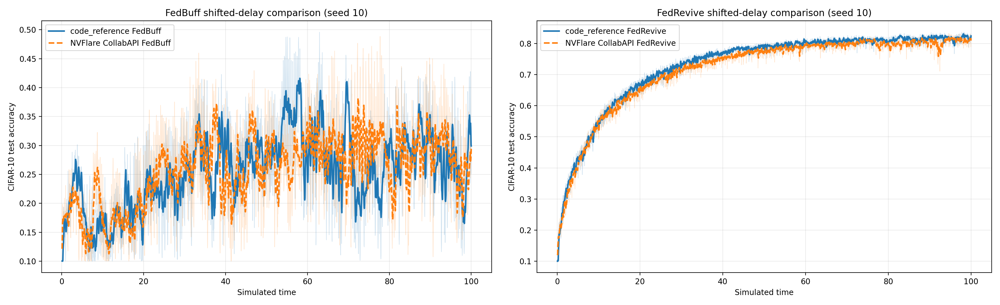

# FedRevive: Reviving Stale Updates with Data-Free Knowledge Distillation

This research project implements [FedRevive](https://arxiv.org/abs/2511.00655)
with the NVIDIA FLARE Collab API. It targets the CIFAR-10 experiment in the
paper and provides FedAvg, FedBuff, and FedRevive through one workflow.

FedRevive retains the ordinary parameter-space update from an asynchronous
client and supplements stale updates with server-side data-free knowledge
distillation (DFKD). Recent returned client models act as teachers, a
persistent meta-learned generator produces synthetic inputs, and a
staleness-dependent coefficient blends the client and distilled updates.

## Scope

The initial scope is the CIFAR-10 comparison of FedAvg, FedBuff, and FedRevive.
It uses the model, data partition, runtime distributions, and training settings
from the standalone simulator used for the paper. It is intentionally separate
from the other NVIDIA FLARE CIFAR-10 examples.

CIFAR-100, FEMNIST, 20NewsGroups, DD-FedRevive, and AFL-DW are outside this
initial contribution.

The local simulator currently uses each client's true class proportions and
synthesizes on every eligible update. The default `reproduction` mode preserves
those choices so its curve can be compared directly with that code. The
optional `paper-aligned` mode instead implements the published proxy estimator
and periodic generator schedule; the distinction is explicit in the CLI and
saved results.

## FedRevive modes

Select the published method with `--fedrevive-mode paper-aligned`. For each
logical client, the server probes only its first two ordinarily uploaded models
with fresh i.i.d. Gaussian CIFAR-shaped inputs. It averages the resulting
softmax vectors using the CIFAR-10 probe temperature $T_{probe}=0.8$, uses the
first estimate as a running proxy until the second arrives, and then freezes
the average. This adds no client computation, label histogram, or message
field. The implementation discards the prepared manifest's oracle proportions
from its server-side copy in this mode.

The paper does not report the number of Gaussian probe inputs. This
implementation uses 64, matching its reported synthesis batch size. One
reusable probing model serves all 1,000 logical clients; persistent estimator
state is only one ten-element sum and one count per observed client.

The two modes differ only where needed to distinguish the local simulator from
the published algorithm:

| Mode | Class proportions | Generator interval $T_{gen}$ |
|---|---|---:|
| `reproduction` (default) | Prepared true histogram | Every eligible update |
| `paper-aligned` | First-two-upload server proxy | 10 server versions |

Both use $K_{synth}=2$, $K_{KD}=10$, and an eight-model teacher buffer
($c=8$). Distillation still occurs on every eligible stale arrival after
warmup; between periodic synthesis steps, paper-aligned mode reuses the bounded
synthetic pool.

## Unified scheduling and aggregation

The server exposes three scheduling parameters:

- `K` (`--num-active-jobs`) is the maximum number of concurrent client jobs.
- `B` (`--buffer-size`) is the number of returned updates required to create a
  new global model version.
- `O` (`--min-open-slots`) is the number of open execution slots required
  before the current global model is distributed to more clients.

All returned models pass through the same update function. The client delta is
computed against the exact model snapshot used by that assignment. By default,
`--in-time` adds each accepted delta to a running sum and retains only that sum
and a count. This is a storage optimization: the global model is still updated
only after `B` contributions. Use `--no-in-time` to retain the individual
deltas until that same boundary. The Figure 2 presets are:

| Method | `K` | `B` | `O` | Server learning rate |
|---|---:|---:|---:|---:|
| FedAvg | 100 | 100 | 100 | 1.4 |
| FedBuff | 100 | 2 | 1 | 0.05 |
| FedRevive | 100 | 1 | 1 | 0.10 |

Thus, FedAvg waits for all 100 results before producing and redistributing the
next global model; FedBuff immediately refills each open slot but creates a
version every two arrivals; and FedRevive immediately refills the open slot
and creates a version from each arrival. Explicit CLI overrides allow other
`K/B/O` configurations.

The Collab calls are genuinely nonblocking. Physical sites perform PyTorch
training while the server keeps other calls in flight. For reproducible
comparison with the event simulator, the server uses the same seeded event
order: it selects clients, then samples training time when each download event
fires and upload time when each training event fires. The server accepts
completed calls in simulated upload order, so host scheduling does not change
logical participation, model snapshots, or staleness.

The number of physical Collab sites is an execution-pool setting and need not
equal `K`. The simulator uses 2 sites by default: all `K=100` logical
assignments are still created at the same simulated time, while idle physical
workers execute pending assignments. Results are accepted only in simulated
finish-time order. `--max-parallel` separately caps concurrent Collab RPCs (2
by default). These host controls do not change logical participation,
snapshots, staleness, buffer boundaries, or simulated time.

Each physical worker multiplexes many logical clients. A logical client's
prepared shard and runtime profile persist on disk, while the worker reuses a
single model. Adam is intentionally recreated for every assignment, matching
the reference simulator. After returning the CPU model state, the worker moves
its reusable model back to CPU, clears unused CUDA allocations, and returns
freed model-transfer pages to the OS. Keeping the physical pool and
`--max-parallel` small bounds simulator processes, Collab
call threads, dataset copies, and CUDA contexts without changing logical
`K=100`. The launcher also fixes native BLAS/OpenMP pools to one thread per
worker so sequential RPCs cannot accumulate idle native thread teams and their
stacks.

Returned client tensors are downloaded directly into a temporary offload
directory inside the server run directory. The server keeps only lazy tensor
references while a physically completed result waits for its seeded simulated
upload event. It materializes that model only when the event becomes due, then
deletes its files immediately. This preserves the reference completion order
without keeping all out-of-order client models in memory; the complete offload
directory is also removed when the workflow exits or aborts. This applies to
the sequence-following wait queue. Once accepted, FedAvg and FedBuff updates
are folded into the in-time accumulator by default; FedRevive's eight-model
teacher buffer remains separate algorithmic state.

Assignment base snapshots use a second, reference-counted disk cache. The
arbitrary arrival schedule can leave many jobs based on older global versions,
and each returned model must be differenced against its exact starting model.
The server serializes each live global version once, memory-maps it only while
dispatching or processing an update, and deletes it after the last assignment
that references it. Thus pending and later-needed snapshots consume disk
rather than anonymous RAM without changing staleness or update values. A fixed
pool of result-watch threads likewise bounds nonblocking-call bookkeeping by
the number of physical sites. Both temporary caches are removed at workflow
shutdown; final models and experiment results are unaffected.

## FedRevive update

The server keeps the eight most recently returned client models. It adds each
return to this teacher buffer before processing the update. For an update with
staleness $\tau$, FedRevive uses

$$
\beta(\tau) = 1 - \frac{1}{2}\left(1 +
\cos\left(\frac{\pi\tau}{2s_{max}}\right)\right), \qquad s_{max}=75,
$$

clipped to $[0,1]$. If $\widetilde{\Delta}_i$ is the ordinary client delta
and $\widetilde{\Delta}^{KD}_i$ is the DFKD student delta, the processed update
is

$$
(1-\beta(\tau))\widetilde{\Delta}_i
+ \beta(\tau)\widetilde{\Delta}^{KD}_i.
$$

DFKD starts after model version 50 when the accepted update has nonzero
staleness. In default reproduction mode, every such eligible update performs
all four steps below. In paper-aligned mode, steps 1--3 occur only when the
model version is divisible by $T_{gen}=10$, while step 4 still occurs per
eligible update after the version-100 warmup:

1. adapts a fast copy of the persistent generator for two synthesis steps;
2. applies a Reptile update to the persistent generator;
3. adds the best generated batch to a bounded 16,000-image pool; and
4. after the version-100 warmup, trains a student for ten multi-teacher KD
   iterations and returns its delta from the current global model.

All synthesis and KD work is server-side. No synthetic data is sent to clients.

## CIFAR-10 configuration

| Category | Setting |
|---|---|
| Logical clients | 1,000 |
| Concurrent jobs | 100 |
| Samples per logical client | 350 |
| Data heterogeneity | Dirichlet, $\alpha=0.5$ |
| Train/validation/KD split | 37,500 / 7,500 / 5,000 |
| Model | CIFAR ResNet-18 with feature-statistic trackers |
| Client optimizer | Adam |
| Client learning rate | $3\times10^{-4}$ |
| Client batch size | 32 |
| Local iterations | 25 |
| Teacher buffer | 8 models |
| Synthesis batch / steps | 64 / 2 |
| Generator interval | 10 versions in paper-aligned mode |
| Generator / latent learning rate | 0.003 / 0.001 |
| KD batch / iterations / learning rate | 32 per teacher / 10 / $10^{-4}$ |
| DFKD weights | adversarial 0.1, feature 0.003, one-hot 1.0 |
| Simulated-time budget | 200 |

Each logical client has persistent runtime characteristics. Local-training time
is exponential with a mean drawn from 1.0, 1.3, or 1.6 with probabilities
0.25, 0.50, and 0.25. Download time is 0.1. Upload time is uniform within 0.02
of a client mean drawn equally from 0.15 and 0.25.

Figure 3 uses the paper's shifted delay schedule to test sensitivity to the
arrival process: every client's exponential local-training mean is 0.1,
download time is 0.02, and upload time is uniform within 0.01 of a persistent
client mean drawn equally from 0.05 and 0.10. All algorithm and optimization
settings remain unchanged. Because the delay schedule changes which client
updates become stale and which updates share a FedBuff boundary, it is stored
in the prepared-data manifest and checked by `job.py`; a run cannot silently
use a manifest prepared for the other schedule. The CIFAR-10 panel in Figure 3
uses a 100-unit simulated-time window.

## Setup and data preparation

Run from this directory using an NVIDIA FLARE `main` checkout:

```bash
cd research/fedrevive
python -m pip install -e ../..
python -m pip install -r requirements.txt
```

Prepare CIFAR-10 and the 1,000 deterministic logical shards once:

```bash
python prepare_data.py \
  --download-root /tmp/cifar10 \
  --output-root /tmp/fedrevive/cifar10 \
  --num-logical-clients 1000 \
  --client-data-size 350 \
  --alpha 0.5 \
  --setup-seed 10
```

Prepare a separate manifest for the shifted Figure 3 schedule. The same seed
recreates the identical logical CIFAR-10 shards while recording the alternate
runtime profiles:

```bash
python prepare_data.py \
  --download-root /tmp/cifar10 \
  --output-root /tmp/fedrevive/cifar10_shifted \
  --delay-schedule shifted \
  --num-logical-clients 1000 \
  --client-data-size 350 \
  --alpha 0.5 \
  --setup-seed 10
```

The prepared manifest and shards live outside the repository. Logical shards
can overlap, matching the reference simulator's wraparound allocation when the
requested population exceeds the available training examples.

## Run the experiments

Each method uses the same entry point and defaults to its table preset:

```bash
python job.py --method fedavg \
  --data-root /tmp/cifar10 --prepared-data-root /tmp/fedrevive/cifar10 \
  --max-time 200 --setup-seed 10 --run-seed 10

python job.py --method fedbuff \
  --data-root /tmp/cifar10 --prepared-data-root /tmp/fedrevive/cifar10 \
  --max-time 200 --setup-seed 10 --run-seed 10

python job.py --method fedrevive \
  --data-root /tmp/cifar10 --prepared-data-root /tmp/fedrevive/cifar10 \
  --max-time 200 --setup-seed 10 --run-seed 10
```

To run the published proxy and periodic-synthesis formulation:

```bash
python job.py --method fedrevive \
  --fedrevive-mode paper-aligned \
  --data-root /tmp/cifar10 --prepared-data-root /tmp/fedrevive/cifar10 \
  --max-time 200 --setup-seed 10 --run-seed 10
```

After establishing the Figure 2 baseline, run FedRevive under the shifted
schedule by selecting its matching manifest explicitly:

```bash
python job.py --method fedrevive \
  --delay-schedule shifted \
  --data-root /tmp/cifar10 \
  --prepared-data-root /tmp/fedrevive/cifar10_shifted \
  --max-time 100 --setup-seed 10 --run-seed 10
```

Add `--fedrevive-mode paper-aligned` to that command to combine the published
class-proportion proxy and periodic generator schedule with the shifted delay
schedule.

A CUDA-capable GPU is recommended for both client training and FedRevive's
server-side DFKD. Device selection defaults to `auto`; use `--client-device
cpu` when GPU sharing is not appropriate. Use `--num-clients` to size the
physical worker pool independently of logical `K`, and `--workspace-root` to
select the output location.

For a small functional test, reduce both the number of physical clients and
`K`, and cap the number of versions:

```bash
python job.py --method fedrevive \
  --num-clients 2 --num-active-jobs 2 --buffer-size 1 --min-open-slots 1 \
  --local-iterations 1 --max-model-versions 54 --max-time 1000 \
  --eval-interval 54 --server-device cpu
```

## Evaluation protocol

For direct comparison under different settings, every reported point is a
centralized evaluation of the global model on the same official CIFAR-10 test
set. Clients do not evaluate global models. This avoids requiring every site to
evaluate every asynchronous version, which would interrupt asynchronous
progress and make the evaluation load method-dependent.

FedAvg is evaluated after each global version. FedBuff and FedRevive are
evaluated every ten versions, matching the standalone reference cadence. A
final evaluation is added only when the last version was not already evaluated.
Because progression uses sampled simulated time, centralized evaluation changes
host runtime but not client completion order or simulated time.

The server writes `accuracy_history.json`, `results.json`, a final model, DFKD
pool checkpoints, and TensorBoard events in the NVFlare run directory.

## Established reference baseline

Before running the Collab port, the standalone simulator was run for seed 10
with a 200-unit simulated-time budget. These are the direct reproduction
targets for the first NVFlare run:

| Method | Versions at stop | Final accuracy | Best accuracy |
|---|---:|---:|---:|
| FedAvg | 28 | 0.4110 | 0.4110 |
| FedBuff | 6,248 | 0.6608 | 0.6858 |
| FedRevive | 12,677 | 0.7451 | 0.7682 |

The FedRevive result is consistent with the approximately 0.75 accuracy near
simulated time 200 in the paper's raw curve. These are single-seed raw results,
not the paper's three-seed averages or running-average summary.

## Shifted-delay comparison

The reference simulator and Collab implementation were also run with seed 10
for 100 simulated-time units under the Figure 3 shifted delay schedule. The
thin traces below are raw centralized evaluations; the emphasized curves use
the same ten-point moving average and are compared after interpolation onto a
shared simulated-time grid.



| Method | Smoothed RMSE | Reference final accuracy | Collab final accuracy |
|---|---:|---:|---:|
| FedBuff | 0.0604 | 0.2820 | 0.3019 |
| FedRevive | 0.0172 | 0.8302 | 0.7917 |

FedBuff exhibits large arrival-schedule-dependent fluctuations in both
implementations, while the FedRevive trajectories remain closely aligned and
substantially more stable under the same schedule. These are single-seed
reproduction results rather than the paper's three-seed averages.

## Repository layout

```text
fedrevive/
├── README.md
├── figs/
│   └── shifted_comparison.png
├── requirements.txt
├── prepare_data.py
├── data.py
├── model.py
├── client.py
├── server.py
├── fedrevive.py
├── dfkd.py
├── job.py
└── trace_resources.py
```

## Citation

```bibtex
@misc{askin2025fedrevive,
  title         = {Reviving Stale Updates: Data-Free Knowledge Distillation for Asynchronous Federated Learning},
  author        = {Baris Askin and Holger R. Roth and Zhenyu Sun and Carlee Joe-Wong and Gauri Joshi and Ziyue Xu},
  year          = {2025},
  eprint        = {2511.00655},
  archivePrefix = {arXiv},
  primaryClass  = {cs.LG},
  url           = {https://arxiv.org/abs/2511.00655}
}
```

Research projects under `research/` are community contributions and are not
maintained by the NVIDIA FLARE team after contribution.
