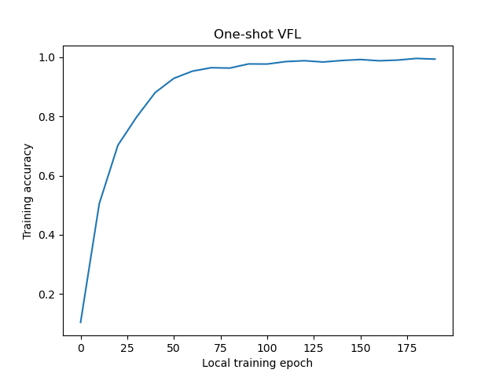

# One-shot Vertical Federated Learning with CIFAR-10

This example includes instructions on how to run [one-shot vertical federated learning](https://arxiv.org/abs/2303.16270) using the 
CIFAR-10 dataset and the [FL simulator](https://nvflare.readthedocs.io/en/latest/user_guide/nvflare_cli/fl_simulator.html).

We assume one client holds the images, and the other client holds the labels to compute losses and accuracy metrics. 
Activations and corresponding gradients are being exchanged between the clients using NVFlare.

###### Abstract:
> Federated learning is a popular collaborative learning approach that enables clients to train a global model without sharing their local data. Vertical federated learning (VFL) deals with scenarios in which the data on clients have different feature spaces but share some overlapping samples. Existing VFL approaches suffer from high communication costs and cannot deal efficiently with limited overlapping samples commonly seen in the real world. We propose a practical vertical federated learning (VFL) framework called **one-shot VFL** that can solve the communication bottleneck and the problem of limited overlapping samples simultaneously based on semi-supervised learning. We also propose **few-shot VFL** to improve the accuracy further with just one more communication round between the server and the clients. In our proposed framework, the clients only need to communicate with the server once or only a few times. We evaluate the proposed VFL framework on both image and tabular datasets. Our methods can improve the accuracy by more than 46.5% and reduce the communication cost by more than 330 times compared with state-of-the-art VFL methods when evaluated on CIFAR-10.


For instructions of how to run CIFAR-10 in real-world deployment settings, 
see the example on ["Real-world Federated Learning with CIFAR-10"](../../examples/advanced/cifar10/cifar10-real-world/README.md).

## License
The code in this directory is released under Apache v2 License.

## 1. Setup
This examples uses [JupyterLab](https://jupyter.org).

We recommend creating a [virtual environment](../../examples/README.md#set-up-a-virtual-environment) and installing the requirements.
```
pip install -r requirements.txt
```

## 2. Start JupyterLab
To run the example, we recommend a GPU with at least 16 GB of memory.

Set `PYTHONPATH` to include custom files of this example and some reused files from the [CIFAR-10](../../examples/advanced/cifar10) examples:
```
export PYTHONPATH=${PWD}/src:${PWD}/../../examples/advanced/cifar10:${PWD}/../../examples/advanced/vertical_federated_learning/cifar10-splitnn/src
```
Start Jupyter Lab
```
jupyter lab .
```
and open [cifar10_oneshot_vfl.ipynb](./cifar10_oneshot_vfl.ipynb).

## 3. Example results
An example local training curve with an overlap of 10,000 samples is shown below.
One-shot VFL only requires the client to conduct two uploads and one download, which reduces the communication cost significantly. This CIFAR10 example can achieve a test accuracy of 79.0%, which is nearly the same as the results of vanilla [single-client VFL (split learning)](https://github.com/jeremy313/NVFlare/tree/dev/examples/advanced/vertical_federated_learning/cifar10-splitnn).



## Citation

> Sun, Jingwei, et al. "Communication-efficient vertical federated learning with limited overlapping samples." Proceedings of the IEEE/CVF International Conference on Computer Vision. 2023.

BibTeX
```
@inproceedings{sun2023communication,
  title={Communication-efficient vertical federated learning with limited overlapping samples},
  author={Sun, Jingwei and Xu, Ziyue and Yang, Dong and Nath, Vishwesh and Li, Wenqi and Zhao, Can and Xu, Daguang and Chen, Yiran and Roth, Holger R},
  booktitle={Proceedings of the IEEE/CVF International Conference on Computer Vision},
  pages={5203--5212},
  year={2023}
}
```
