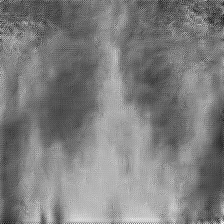
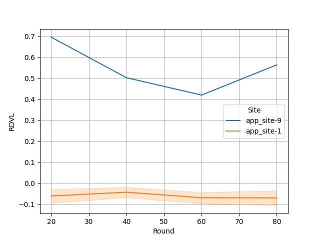
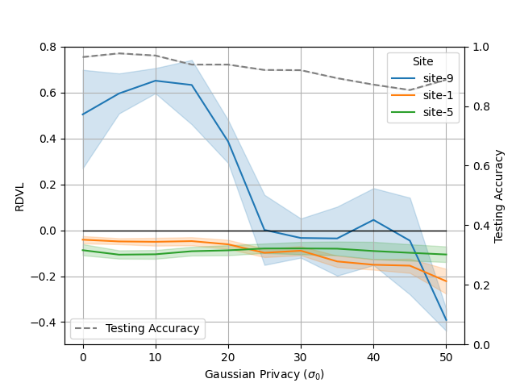

# Quantifying Data Leakage in Federated Learning

This directory contains the tools necessary to recreate the chest X-ray experiments described in


### Do Gradient Inversion Attacks Make Federated Learning Unsafe? ([arXiv:2202.06924](https://arxiv.org/abs/2202.06924))
Accepted to [IEEE Transactions on Medical Imaging](https://ieeexplore.ieee.org/document/10025466)
Special Issue on Federated Learning.

###### Abstract:

> Federated learning (FL) allows the collaborative training of AI models without needing to share raw data. This capability makes it especially interesting for healthcare applications where patient and data privacy is of utmost concern. However, recent works on the inversion of deep neural networks from model gradients raised concerns about the security of FL in preventing the leakage of training data. In this work, we show that these attacks presented in the literature are impractical in real FL use-cases and provide a new baseline attack that works for more realistic scenarios where the clients' training involves updating the Batch Normalization (BN) statistics. Furthermore, we present new ways to measure and visualize potential data leakage in FL. Our work is a step towards establishing reproducible methods of measuring data leakage in FL and could help determine the optimal tradeoffs between privacy-preserving techniques, such as differential privacy, and model accuracy based on quantifiable metrics.

## License
- The code in this directory is released under Apache v2 License.
- The example gradient inversion code used in this example is available at 
  [NVlabs/DeepInversion](https://github.com/NVlabs/DeepInversion) and 
  released under its own [license](https://github.com/NVlabs/DeepInversion/blob/master/LICENSE).

## Setup

Install required packages for training
```
pip install --upgrade pip
pip install -r ./requirements.txt
```

Download the inversion code
```
git clone https://github.com/NVlabs/DeepInversion.git
```

Config the Python environment
Set `PYTHONPATH` to include custom files of this example:
```
export PYTHONPATH="${PWD}/src:${PWD}/DeepInversion/FLGradientInversion"
```

### 1. Download dataset

Download the dataset from the [COVID-19 Radiography Database](https://www.kaggle.com/datasets/tawsifurrahman/covid19-radiography-database)
and extract under `./data`. The downloaded `archive.zip` should contain a 
folder called `COVID-19_Radiography_Dataset` which we note as `DATA_ROOT`.

```
DATA_ROOT=$(find ${PWD}/data -name "COVID-19_Radiography_Dataset")
echo "DATA_ROOT is ${DATA_ROOT}"
```

We prepared two job configurations to run below experiments.
Let's update them to use the downloaded dataset and dataset lists provided 
in the "data" directory.

#### cxr_1client
To run a "quick" experiment, we can simulate only one client. 
In order to reduce the runtime and show the risk of gradient inversion attacks,
we simulate one "high-risk" client that sends updates based just on one 
training image and iteration. Therefore, the batch size is 1.

We modify the client's config file to use the downloaded data and use the 
prepared dataset list for client 9. 
Furthermore, we need to modify the gradient inversion config file to use 
the downloaded prior image (part of DeepInversion package).

This can be done by using the provided template configure files in 
[./jobs/app_template](jobs/app_template).
```
python3 -m nvflare_gradinv.utils.create_job_config --app_folder ./jobs/app_template \
--n_clients 1 --num_rounds 3 \
--data_root=${DATA_ROOT} --dataset_json=${PWD}/data/data_200val+rest_client \
--prior_file=${PWD}/DeepInversion/FLGradientInversion/prior/prior_1.jpg \
--output ./jobs/cxr_1client
```

#### cxr_9clients
To run a full FL experiment with longer training, we prepared several clients 
with different dataset sizes and batch sizes. 
Due to resource limitations (nr. GPUs, memory, etc.), 
we only run the inversion filter on a subset of the clients 
that are at higher risk of leaking information due to smaller datasets and 
batch sizes.

| Client                 | Batch Size | # Training | # Validation | Invert? |
|------------------------|------------|------------|--------------|---------|
| client 1               | 4          | 8          | 200          | x       |
| client 2               | 4          | 32         | 200          |         |
| client 3               | 4          | 128        | 200          |         |
| client 4               | 4          | 512        | 200          |         |
| client 5               | 8          | 8          | 200          | x       |
| client 6               | 8          | 32         | 200          |         |
| client 7               | 8          | 128        | 200          | x       |
| client 8               | 8          | 512        | 200          |         |
| client 9 ("high-risk") | 1          | 1          | 200          | x       |
| Sum                    |            | 1360       | 1600         |         |
Nr. Testing: 1382

We can modify to client and gradient inversion config files to use the 
downloaded data, above dataset, and prior image using
```
python3 -m nvflare_gradinv.utils.create_job_config --app_folder ./jobs/app_template \
--n_clients 9 --num_rounds 100 \
--invert_clients 1,5,9 --batch_sizes 4,4,4,4,8,8,8,8,1 \
--data_root=${DATA_ROOT} --dataset_json=${PWD}/data/data_200val+rest_client \
--prior_file=${PWD}/DeepInversion/FLGradientInversion/prior/prior_1.jpg \
--output ./jobs/cxr_9clients
```


### 2. Start FL experiment

To run the "quick" FL experiment, inverting one client, execute
```
N_CLIENTS=1
JOB=./jobs/cxr_1client
EXP_NAME=exp1
./start_fl_sim.sh ${N_CLIENTS} ${JOB} ${EXP_NAME} 
```

To run the full FL experiment, inverting 3 out of 9 clients, execute
```
N_CLIENTS=9
JOB=./jobs/cxr_9clients
EXP_NAME=exp1
./start_fl_sim.sh ${N_CLIENTS} ${JOB} ${EXP_NAME}
```

### 3. Visualize results
In order to reduce the possibility of data leakage through gradient 
inversion attacks, we use the [GaussianPrivacy](./src/nvflare_gradinv/filters/gaussian_privacy.py) filter.
The filter's `sigma0` argument defines how much noise is to be added to 
the outgoing model updates. In order to compute the added noise adaptively 
with respect to the model updates, we compute the 95th 
percentile of absolute model update values and multiply this value by `sigma0` to arrive 
at the `sigma` used to define Gaussian distribution with zero mean. 
This Gaussian distribution is then sampled to add calibrated noise to each 
model update.

> **Note**: You can use `` with the `--sigma0` argument to define a 
> different noise level for all clients.   

#### Inverted training images
As an example, we show the reconstruction from **site-9** sending updates 
based on only one image with different levels of 
`sigma0`. 
Sending updates based on a few images and small batch sizes can 
leak a significant amount of information. 
However, one can observe that higher values of added noise effectively reduce the 
success of the gradient inversion attack. 
For more details, see the [paper](https://arxiv.org/abs/2202.06924).

| Original                                                                                        | sigma0=0                                       | sigma0=10                                       | sigma0=20                                       | sigma0=30                                       | sigma0=40                                       | sigma0=50                                       |
|-------------------------------------------------------------------------------------------------|------------------------------------------------|-------------------------------------------------|-------------------------------------------------|-------------------------------------------------|-------------------------------------------------|-------------------------------------------------|
|   |  |  |  |  |  |  |

#### RDLV per FL training round
Using the `RelativeDataLeakageValueFilter`, we can quantify the data 
leakage for each client and visualize it as a function of the FL training 
rounds. One can observe that the "high-risk" **site-9** (sending updates based on one 
image)
leaks significantly more data than clients sending updates after training 
using a larger batch size, i.e. **site-1**, which uses a batch size of 4 
and iterates over 8 training images.

To plot this graph, use [plot_rdlv_per_round.py](./src/nvflare_gradinv/utils/plot_rdlv_per_round.py).



#### RDLV vs. Gaussian privacy

Furthermore, we can visualize the relative data leakage values with respect 
to different `GaussianPrivacy` settings, i.e. different values of `sigma0`. 
Again, only the "high-risk" client of **site-9** sending updates based on 
one image is leaking significant data up until using a higher privacy 
setting. As expected, higher values of `sigma0` will negatively 
impact the testing accuracy of the best global model as shown.

To plot this graph, use [plot_rdlv_vs_gauss.py](./src/nvflare_gradinv/utils/plot_rdlv_vs_gauss.py).
For more details, see the [paper](https://arxiv.org/abs/2202.06924).



### 4. Implementation

#### Relative Data Leakage Value Filter
Below we show a breakdown of the different components and their core arguments 
needed to run gradient inversion and compute the RDLV for a client.
The `RelativeDataLeakageValueFilter` takes an `Inverter` and `SimMetric` as input 
selecting them from the FL engine via their name arguments.
Here, we use the `GradInversionInverter` class, which also takes a 
`Learner` as input 
to extract the relevant local training parameters needed for the inversion class.

Depending on your application, the implementations of the `Inverter` and 
`SimMetric` classes can be modified to use different inversion libraries 
and similarity metrics.


## Citation

> A. Hatamizadeh et al., "Do Gradient Inversion Attacks Make Federated Learning Unsafe?," in IEEE Transactions on Medical Imaging, doi: 10.1109/TMI.2023.3239391.

BibTeX
```
@ARTICLE{10025466,
  author={Hatamizadeh, Ali and Yin, Hongxu and Molchanov, Pavlo and Myronenko, Andriy and Li, Wenqi and Dogra, Prerna and Feng, Andrew and Flores, Mona G. and Kautz, Jan and Xu, Daguang and Roth, Holger R.},
  journal={IEEE Transactions on Medical Imaging}, 
  title={Do Gradient Inversion Attacks Make Federated Learning Unsafe?}, 
  year={2023},
  volume={},
  number={},
  pages={1-1},
  doi={10.1109/TMI.2023.3239391}}
```
